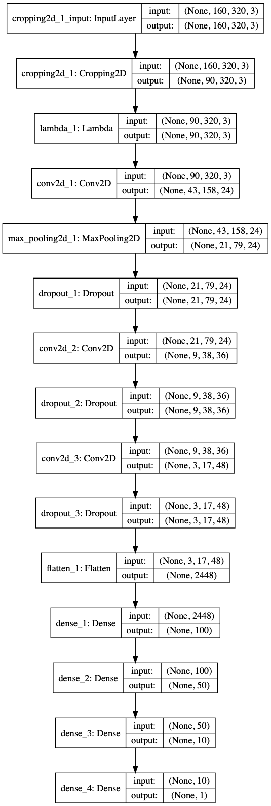
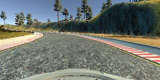
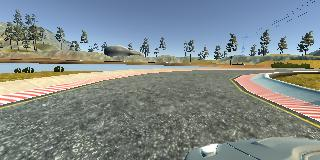
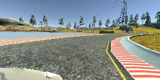

# **Behavioral Cloning** 

## Writeup Template

---

**Behavioral Cloning Project**

The goals / steps of this project are the following:
* Use the simulator to collect data of good driving behavior
* Build, a convolution neural network in Keras that predicts steering angles from images
* Train and validate the model with a training and validation set
* Test that the model successfully drives around track one without leaving the road
* Summarize the results with a written report


[//]: # (Image References)

[image1]: ./examples/placeholder.png "Model Visualization"
[image2]: ./examples/placeholder.png "Grayscaling"
[image3]: ./examples/placeholder_small.png "Recovery Image"
[image4]: ./examples/placeholder_small.png "Recovery Image"
[image5]: ./examples/placeholder_small.png "Recovery Image"
[image6]: ./examples/placeholder_small.png "Normal Image"
[image7]: ./examples/placeholder_small.png "Flipped Image"

## Rubric Points
### Here I will consider the [rubric points](https://review.udacity.com/#!/rubrics/432/view) individually and describe how I addressed each point in my implementation.  

---
### Files Submitted & Code Quality

#### 1. Submission includes all required files and can be used to run the simulator in autonomous mode

My project includes the following files:
* model.py containing the script to create and train the model
* drive.py for driving the car in autonomous mode
* model.h5 containing a trained convolution neural network 
* writeup_report.md or writeup_report.pdf summarizing the results

#### 2. Submission includes functional code
Using the Udacity provided simulator and my drive.py file, the car can be driven autonomously around the track by executing 
```sh
python drive.py model.h5
```

#### 3. Submission code is usable and readable

The model.py file contains the code for training and saving the convolution neural network. The file shows the pipeline I used for training and validating the model, and it contains comments to explain how the code works.

### Model Architecture and Training Strategy

#### 1. An appropriate model architecture has been employed

My model consists of 
	

* At first we normalised the dataset using Lambda layers.
* Then we crop the images for only important pixel value within the region of interest.
* 3 Conv layers with (5,5) filter size with volume 24, 36, 48 respectively.
* All conv layers include relu as an output activation function.
* I have used a max pooling layer followed by a first conv layers.
* I have use 3 Dropout layers with drop probability 0.3 after each conv layers.
* After all Conv layers, I flatten all the output neuron
* Used 4 Dense layers with output units 100, 50, 10, 1 respectively

(model.py lines 56-74) 


#### 2. Attempts to reduce overfitting in the model

The model contains dropout layers in order to reduce overfitting.

The model was trained and validated on different data sets to ensure that the model was not overfitting. The model was tested by running it through the simulator and ensuring that the vehicle could stay on the track.

Additionally we added a checkpoint callback from which the model will only save if validation loss will decrease.

#### 3. Model parameter tuning

The model used an adam optimizer, so the learning rate was not tuned manually.

#### 4. Appropriate training data

Training data was chosen to keep the vehicle driving on the road. I used a combination of center lane driving, recovering from the left and right sides of the road, as well as used data augmentation techniques to flip the image.

For details about how I created the training data, see the next section. 

### Model Architecture and Training Strategy

#### 1. Solution Design Approach

The overall strategy for deriving a model architecture was to driving a strategy to create a CNN to correctly predict right angle to turn on the lane lines. 

My first step was to use a convolution neural network model similar to the Lenet architecture. But addition to that I added few extra layers to stop overfitting.

In order to gauge how well the model was working, I split my image and steering angle data into a training and validation set. I found that my first model had a low mean squared error on the training set but a high mean squared error on the validation set. This implied that the model was overfitting. 

To combat the overfitting, I modified the model so that it will not overfitting. For that I augment the dataset and used more datasets. Addtion to that I used dropout layers.

Then I train the model , it seemed to work on validation set.

The final step was to run the simulator to see how well the car was driving around track one. There were a few spots where the vehicle fell off the track. to improve the driving behavior in these cases, I collected more data by run the car on the tracks for few more laps.

At the end of the process, the vehicle is able to drive autonomously around the track without leaving the road.

#### 2. Final Model Architecture

Here is a visualization of the architecture (note: visualizing the architecture is optional according to the project rubric)



#### 3. Creation of the Training Set & Training Process

To capture good driving behavior, I first recorded two laps on track one using center lane driving. Here is an example image of center lane driving:



I then recorded the vehicle recovering from the left side and right sides of the road back to center so that the vehicle would learn to steer angle with more data.

These are images with Left and right Cameras :






To augment the data sat, I also flipped images and angles thinking that this would increase our dataset and make training better.

After the collection process, I had 28080 number of data points. I then preprocess the data by normalizes and croping the region of interest image.


I finally randomly shuffled the data set and put 20% of the data into a validation set. 

I used this training data for training the model. The validation set helped determine if the model was over or under fitting. The ideal number of epochs was 10 as evidenced by validation loss didn't decrease after that.

Final Validation loss was 0.0358.

I used an adam optimizer so that manually training the learning rate wasn't necessary.


# Future Work :

* Use both trackes with more lap.

* Drive clockwise as well anti-clockwise.

* Driving on center lane.

* Use more complex network like resnet or resnext.


